[TOC]


# 前言

iOS开发的组件化方案的文章介绍已经很多了，但是很少有能介绍如何在项目工程中进行实施的，本文则是作者在实际项目中实施组件化方案后总结的一些经验。本文不会讨论太多理论上的知识，主要集中在实施方面。

# 1 组件化实施工具
实施业务组件化是将每一个业务模块单独封装成pods，然后在主工程中通过CocoaPods以组件的方式将所有模块集成进来。组件化的实施需要依赖Git和CocoaPods进行，所以在开始之前需要在macOS上安装好Git和CocoaPods，同时准备好一个Git服务器。本文使用Github为作为例子，使用其它Git服务操作步骤不会有太大的差异。
## 1.1创建组织
实际开发中，每一个业务模块对应一个Git仓库，每一个业务Git仓库对应一个pods，建议将所有仓库放在一个组织（organization）中。如图所示，在Github中创建一个组织。

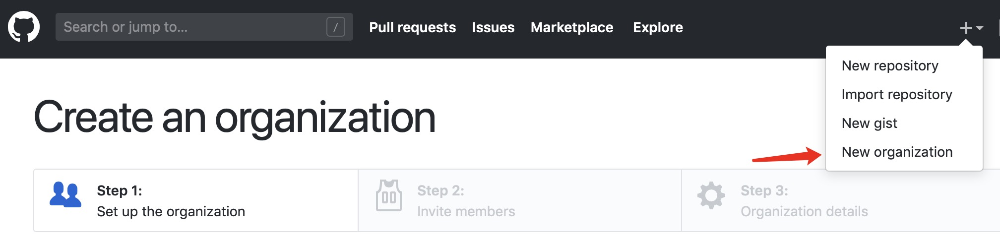

创建完成之后就可以在组织中创建你的业务模块仓库以及邀请你的开发小伙伴进入组织。

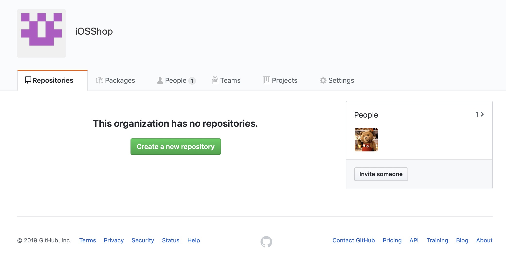

## 1.2创建私有pods仓库
CocoaPods有个默认公共开放的[pods仓库](https://github.com/CocoaPods/Specs)，里面存放了很多开源的iOS组件库供开发者使用，并存放在Github上。但是开发公司项目，代码不会对外开放，所以只能使用私有pods，那么就需要自建私有pods仓库来存放这些私有pods。如图所示，在组织中创建一个空仓库。

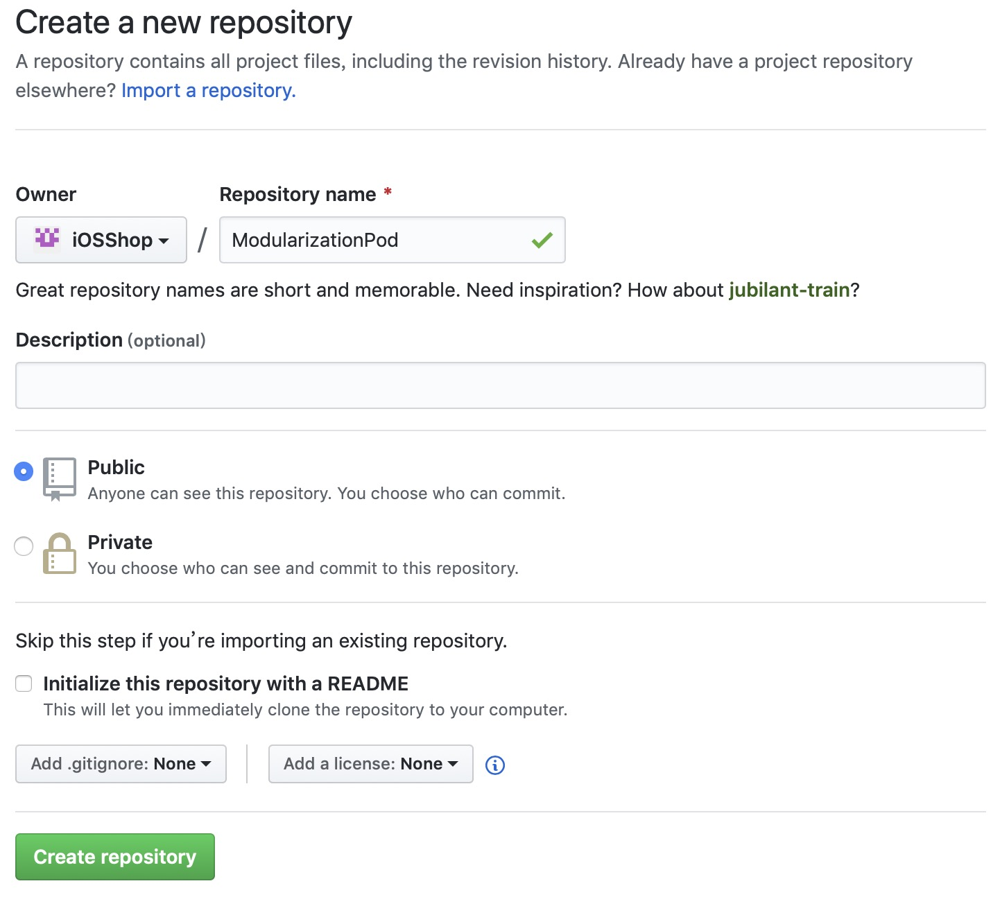
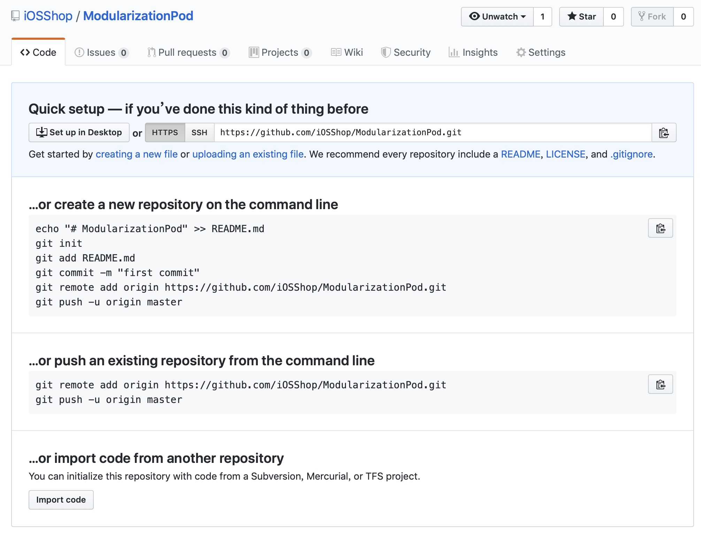

仓库创建完成之后，需要添加一个本地私有pods仓库链接到该远程Git仓库。打开macOS的命令行，输入：

```bash
pod repo add ModularizationPod https://github.com/iOSShop/ModularizationPod.git
```
完成后我们进入到CocoaPods的目录下：

```bash
cd ~/.cocoapods/repos/
open .
```
可以看到目录中看到两个仓库，master是CocoaPods的公共pods仓库，ModularizationPod则是我们创建的私有pods仓库。

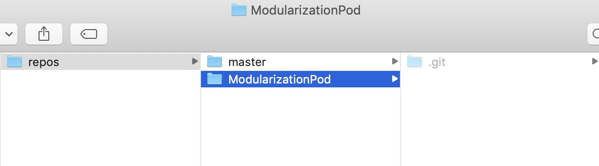

下一步我们在ModularizationPod仓库中添加一个.gitignore文件，可以直接从master的仓库里面复制一个过去。

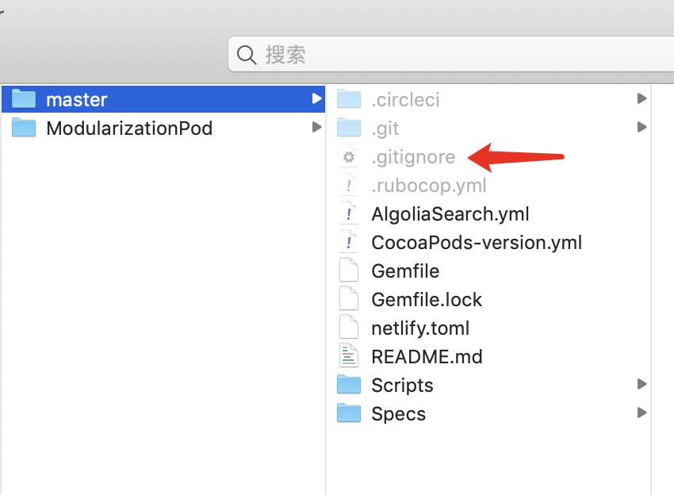

在命令行终端中cd到仓库目录：

```bash
cd /Users/caicai/.cocoapods/repos/ModularizationPod
```

然后我们需要提交到远程Git仓库：

```bash
git add .
git commit -m "first commit"
git push
```
中间可能需要输入账号密码进行Git的身份校验，完成后可以在远程Git仓库上查看。

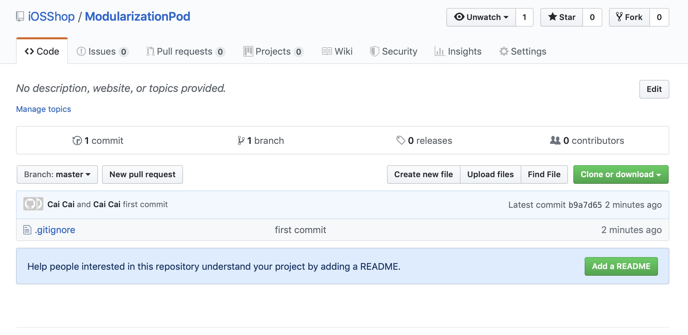

以后这个远程Git仓库会存放我们业务模块的pods信息。

# 2 组件化方案介绍 

本文以一个简单的商城业务来描述组件化方案实施，内容包括如何实现业务模块的组件化、如何进行模块间的调用以及如何进行模块之间通信。我们以基础的账户、商品、订单、支付这四个模块进行举例。

## 2.1如何进行业务模块的拆分

实现业务模块的组件化，是为了将业务拆分出来，降低业务模块之间的耦合性。比如在商品详情页面【点击购买】后下一步就是进入订单生成页面，传统的做法就是直接在商品详情页面的ViewController里面直接import订单生成页面的ViewController，然后实例化ViewController传个值后直接push过去就可以了。当项目规模变大和业务变复杂的时候，这种直接引入代码文件的做法就会使得模块之间的依赖变得越来越强，甚至是牵一发就动全身。即使举例的只有四个模块，相互间的依赖也比较多，如下图所示：

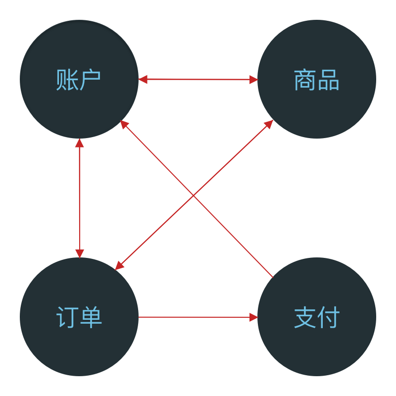

其实这个问题属于通用的软件工程中，不局限于iOS开发中。解决的办法也很简单，提供一个中间人（Mediator）。业务模块之间不直接进行引用，通过Mediator间接形成引用关系，而且在Mediator可以将模块需要暴露出来的业务提供出来给其它模块调用，不需要暴露出来的就不引入Mediator。比如账户模块有登陆页面和注册页面，实际场景中可能只会把登陆页面给其他业务模块调用，注册页面只需要从登陆页面跳转过去就可以了，并不需要提供给其它业务模块调用。如下图所示：

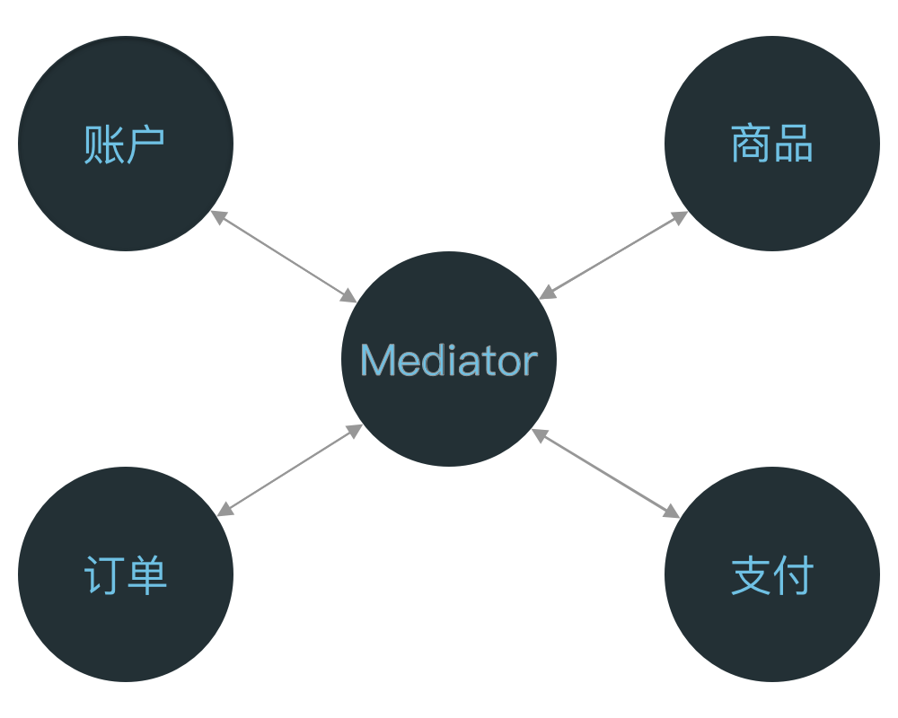


## 2.2以服务的方式解决模块间的调用

通过中间人的方式拆分业务模块后也只是逻辑上清晰了一点，实际上还是在引入业务的代码文件，业务与业务之间的调用依旧很不清晰明了。比如在订单页面弹出一个登陆页面，订单模块的开发人员需要先找到登陆页面的UIViewController文件，然后import进来，接着实例化对象，最后再present或者push这个页面。复杂一点的业务可能还需要以口头或者文档的形式告知调用方如何去使用类文件、如何去传递参数等等。而开发人员想着我只需要一个UIViewController实例化对象就可以了，也不关心它是哪个代码文件、它内部是怎么实现的。

我们可以通过服务的方式去解决这个问题，简单的说就是你需要什么，我给你什么。通过Target-Action，业务提供方将所有的服务以对象方法的形式提供，通过方法的参数和返回值进行模块间的调用和通信。如下图所示：

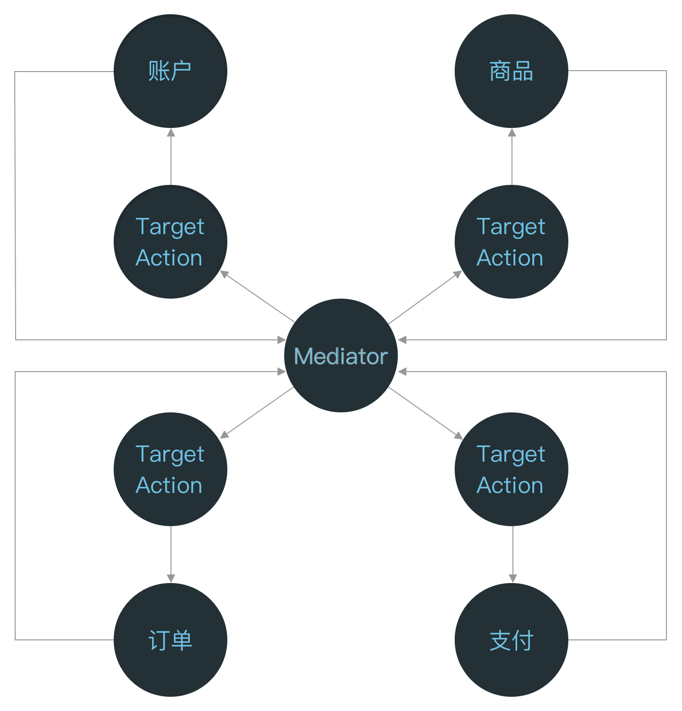


## 2.3解决模块之间的依赖以及去中心化

完成前两步之后，还存在两个问题：

1. Mediator是个中心化的服务，引入Mediator也会将所有业务模块的Target-Action引入进来，不相关的服务反而会变得多余。同时所有业务模块对外提供的服务修改后，都需要去Mediator中做出修改。这样会导致Mediator越来越难以维护。
2. 业务模块之间的依赖并没有减少，虽然业务调用时只import了Mediator，但Mediator会间接引入Target-Action，Target-Action又会间接引入业务代码文件。

第一个问题的解决办法，通过组合的思想，使用Objective-C的分类（Category）将Mediator去中心化。针对每个业务模块创建一个Mediator的分类（Category），并将Target服务引入到分类（Category）中，相当于将Target服务再做一层方法封装，其他业务调用方只需引入相应的分类（Category）即可，这样就可以避免无关业务服务的多余引入。同时业务模块对外提供的服务修改后，相应的业务提供方只需修改自己的分类（Category）即可，Mediator也无需维护，达到真正的去中心化。如下图所示：

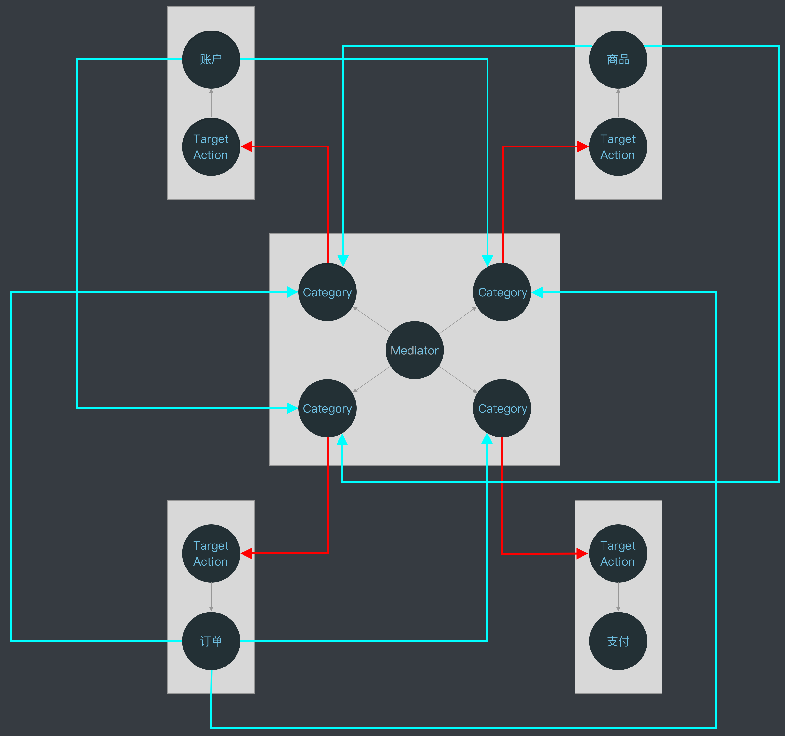

通过上图可以看到模块与模块之间的调用已经没有直接引入了，都是通过category引入。在上图的基础上还是可以看到依赖并没有减少，Category会引用Target-Action，并间接引用源代码文件。

第二个问题的其实就是Category与Target-Action之间的依赖问题，解决办法也很简单粗暴。因为业务模块中对外提供服务的Category中的方法实现其实就是直接调用的Target类里面的Action方法，所以通过runtime的技术就可以直接切段两者之间的依赖。

1. 通过NSClassFromString方法和Target类名获取到Class对象，然后Class对象通过alloc方法和init方法就可以获取到Target实例对象。
2. 通过NSSelectorFromString方法和Action方法名获取到SEL对象。
3. Target实例对象调用- (**id**)performSelector:(**SEL**)aSelector withObject:(**id**)object方法就可以完成服务的调用和通信。

通过以上方法，Category可以不用import就直接调用Target-Action的服务，并传递出去，这样就完成了解除依赖。如下图所示：

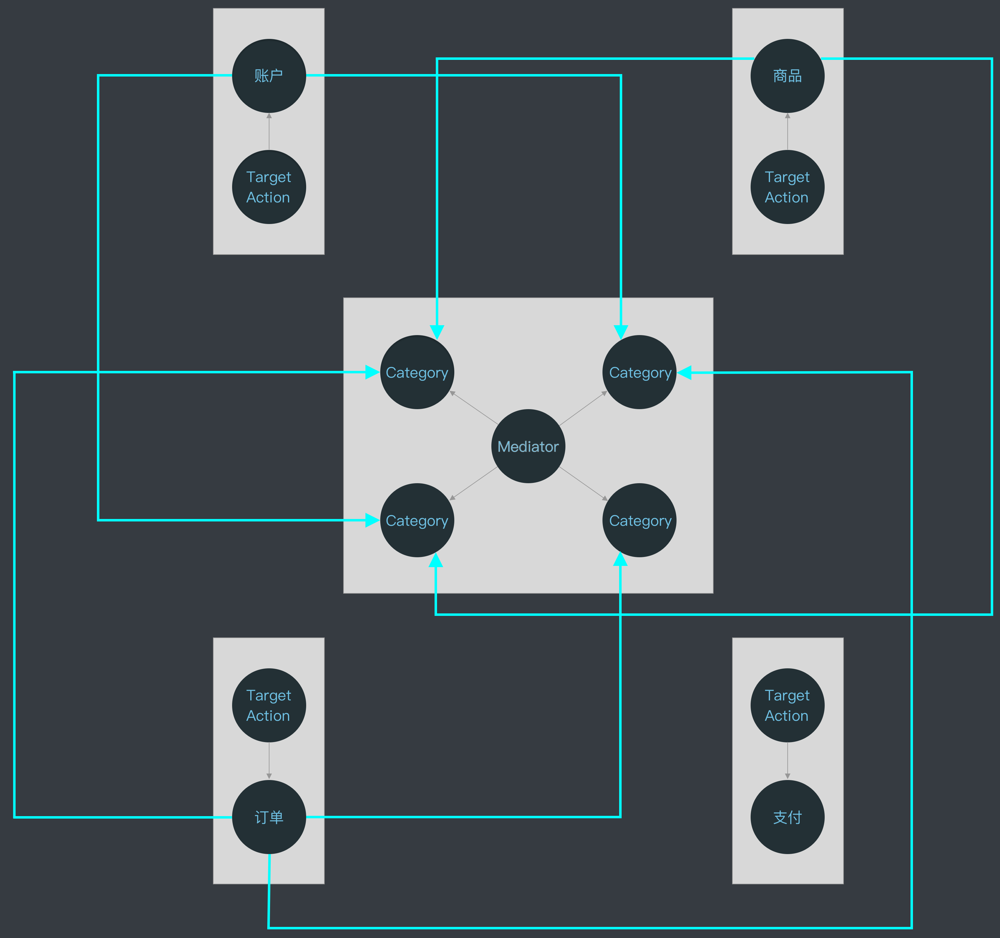

至此，业务架构设计就非常清晰明了。以上就是组件化工程实施的方案。


# 3 组件化工程实施

## 3.1实施的准备

新建一个目录ModularizationProject用于存放所有工程实施的文件，然后在ModularizationProject下新建ConfigPods目录，用于存放一些配置文件，目录及文件结构如下图所示：

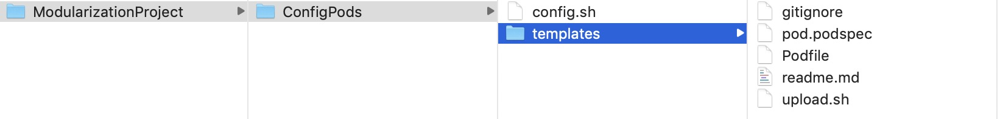

templates目录下的文件都是帮助创建Xcode工程的，通过config.sh的脚本可以快速创建工程并进行私有pods的配置。[查看示例](https://github.com/iOSShop/ConfigPods)

- gitignore可以在Git进行提交时对文件过滤。

- readme.md可以对Git仓库进行一些描述说明，按需要撰写即可。
- Podfile是创建cocoapods工程时必须的文件，示例文件里面第一个source开头后面的地址是私有pods仓库的远程Git仓库地址，改成自己的即可。
- pod.podspec是将工程打包成pods的必要配置文件，里面内容可按需修改。使用示例文件，建议只修改s.author后面的信息就可以了。
- upload.sh里面是打包pods的命令，示例文件里面push后面是私有pods仓库名，--sources后面的参数中第一个是私有pods仓库的远程Git仓库地址，两个都需要改成自己的。
- config.sh是创建整个工程的脚本，建议不做修改直接使用示例文件。

## 3.2创建业务模块工程

1. 在Git组织中创建账户模块的远程仓库。

   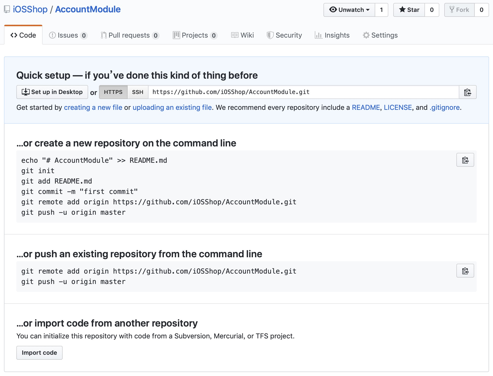

2. 在ModularizationProject中创建一个名为AccountModule的iOS工程，注意创建过程中，Source Control不要勾选。

3. 打开终端命令行cd到config.sh所在的目录，然后执行

   ```bash
   ./config.sh
   ```

   Enter Project Name：输入工程的名字

   > AccountModule

   Enter HTTPS Repo URL：输入工程的远程Git仓库的https地址

   > https://github.com/iOSShop/AccountModule.git

   Enter SSH Repo URL：输入工程的远程Git仓库的地址

   > git@github.com:iOSShop/AccountModule.git

   Enter Home Page URL：输入工程的主页：

   > https://github.com/iOSShop/AccountModule

   confirm：核对以上输入的信息

   > y

4. 账户模块的远程Git仓库就创建完毕，并完成了第一次初始化的提交。

   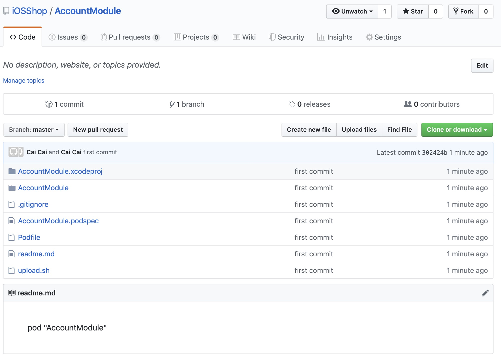

5. 进入本地的AccountModule目录中，然后执行

   ```bash
   pod install
   ```

   完成后，账户模块的cocoapods工程就创建完毕，并可以进行开发了。而且工程中自带资格同名目录，将所有代码文件放在该目录即可。

   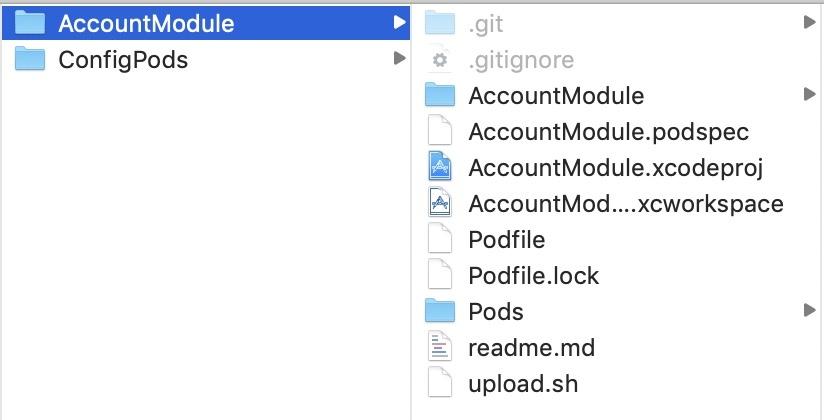

6. 以上步骤通用于创建业务模块工程。

## 3.3创建Target-Action

在进入开发阶段前，需要对各个业务模块的职责进行划分，并规则好各个业务模块需要对外提供的服务，所以我们可以先完成业务模块中大部分Target-Action和对应的Category的编写。拿账户模块来举例，其他业务模块可能需要登陆页面、用户的登录状态、用户登录状态的改变。

账户模块Target-Action中的方法声明：

```objective-c
#import <Foundation/Foundation.h>
#import <UIKit/UIKit.h>

NS_ASSUME_NONNULL_BEGIN

@interface Target_Account : NSObject
/**
 *登录
 **/
- (UIViewController *)Action_nativeLoginViewController;
/**
 *登陆状态
 **/
- (BOOL)Action_nativeLoginStatus;
/**
 *登陆状态改变
 **/
- (NSString *)Action_nativeLoginStatusChangeNotificationName;
@end

NS_ASSUME_NONNULL_END
```

- 登陆页面直接返回对应UIViewController的实例即可。
- 登陆状态只需返回一个BOOL类型即可。
- 登陆状态的改变以notification的方式广播出去，其他模块拿到notification的name进行注册就可以实现登陆状态的监听。

## 3.4创建Category

Mediator思想的实现来源于[CTMediator](https://github.com/casatwy/CTMediator)，核心只有两个文件就已经能满足大部分的使用场景。在实际项目开发中可直接依赖该框架，也可以clone下来后按照需要进行修改。示例中对其进行修改后创建了新的CCMediator，并制作成私有pods库供使用。

1. 按照[3.2](#3.2创建业务模块工程)的完整步骤创建一个名为AccountModule_Category的工程，然后再进入AccountModule_Category工程中，编辑Podfile，加入pod 'CCMediator'，然后再pod install。

2. 创建CTMediator的Category，下面是Category中方法的声明和实现

   ```objective-c
   #import "CCMediator.h"
   
   NS_ASSUME_NONNULL_BEGIN
   
   @interface CCMediator (AccountModule)
   /**
    *登陆(presentViewController)
    **/
   - (UIViewController *)Account_viewControllerForLogin;
   /**
    *登陆状态
    **/
   - (BOOL)Account_statusForLogin;
   /**
    *登陆状态改变
    **/
   - (NSString *)Account_nameForLoginStatusChangeNotification;
   @end
   
   NS_ASSUME_NONNULL_END
   ```

   ```objective-c
   #import "CCMediator+AccountModule.h"
   
   NSString * const MediatorTargetAccount = @"Account";
   NSString * const MediatorActionAccountLoginViewController = @"nativeLoginViewController";
   NSString * const MediatorActionAccountLoginStatus = @"nativeLoginStatus";
   NSString * const MediatorActionAccountLoginStatusChangeNotification = @"nativeLoginStatusChangeNotificationName";
   
   @implementation CCMediator (AccountModule)
   /**
    *登陆(presentViewController)
    **/
   - (UIViewController *)Account_viewControllerForLogin {
       UIViewController *viewController = [self performTarget:MediatorTargetAccount action:MediatorActionAccountLoginViewController params:nil shouldCacheTarget:NO];
       if ([viewController isKindOfClass:[UIViewController class]]) {
           return viewController;
       } else {
           return [[UIViewController alloc] init];
       }
   }
   /**
    *登陆状态
    **/
   - (BOOL)Account_statusForLogin {
       return [[self performTarget:MediatorTargetAccount action:MediatorActionAccountLoginStatus params:nil shouldCacheTarget:NO] boolValue];
   }
   /**
    *登陆状态改变
    **/
   - (NSString *)Account_nameForLoginStatusChangeNotification {
       return [self performTarget:MediatorTargetAccount action:MediatorActionAccountLoginStatusChangeNotification params:nil shouldCacheTarget:NO];
   }
   
   @end
   ```

   通过Category完成服务传递，同时在Mediator中解决了Category与Target-Action之间的依赖。

## 3.5制作私有pods

完成了Category和Target-Action的编写，就可以通过Git提交到远程仓库并生成pods供其它业务模块引用。

步骤如下：

1. 编辑podspec文件，修改s.version的版本，然后针对资源和依赖进行自定义设置，podspec的详细用法可参考[官方指导](https://guides.cocoapods.org)。

2. 打开终端cd到工程目录下，开始提交代码。

   ```bash
   git add .
   git commit -m "add Target-Action"
   git push
   ```

3. 打标签，制作并推送私有pods。tag需要与podspec的s.version保持一致，然后执行目录下的upload.sh脚本。执行过程中可能报错，一定要按照提示去解决。

   ```bash
   git tag 1.0.0
   git push --tags
   ./upload.sh
   ```

4. 制作完成后可以在本地的pods仓库和远程Git仓库中看到被推送的pods信息。

   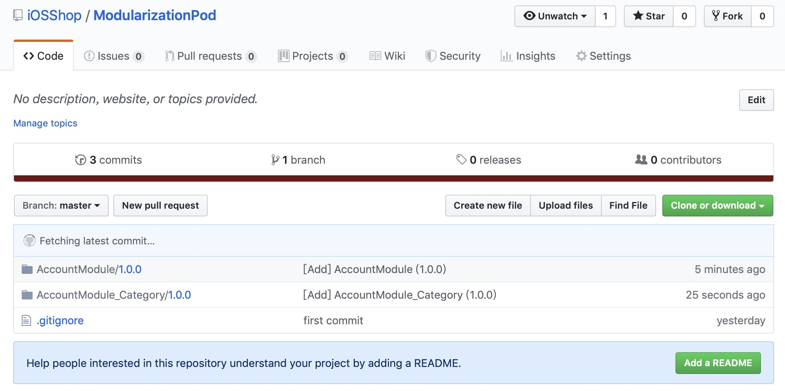

   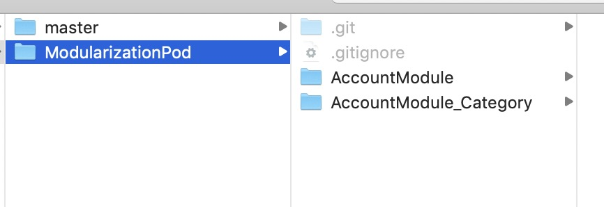

   下面是通过pod search查找的结果：

   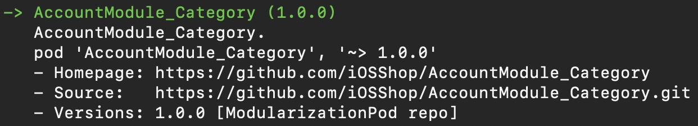

5. 其它业务模块可以直接在其工程的Podfile里面集成AccountModule_Category和AccountModule就可以调用账户模块的服务了。

## 3.6模块间的服务调用

我们以商品模块为例，进入在【我的商品界面】后，需要在该页面判断用户是否登陆了，没有登陆则提示登陆并能跳转到登陆页面，并且还要实时监听用户登陆状态的改变。


1. 实现用户状态的监听

   ```objective-c
   NSString *notificationName = [[CCMediator sharedInstance] Account_nameForLoginStatusChangeNotification];
       [[NSNotificationCenter defaultCenter] addObserver:self selector:@selector(loginStatusChange) name:notificationName object:nil];
   ```

2. 实现监听的方法，当用户登陆时就隐藏提示登陆的页面，当用户未登陆时显示提示登陆的页面。

   ```objective-c
   - (void)loginStatusChange {
       BOOL isLogin = [[CCMediator sharedInstance] Account_statusForLogin];
       self.loginView.hidden = isLogin;
       if (isLogin) {
           [self.view bringSubviewToFront:self.loginView];
       }
   }
   ```

3. 响应提示登陆的操作，弹出登陆页面

   ```objective-c
   - (void)clickLogin {
       UIViewController *viewController = [[CCMediator sharedInstance] Account_viewControllerForLogin];
       [self presentViewController:[[UINavigationController alloc] initWithRootViewController:viewController] animated:YES completion:nil];
   }
   ```

以上是一些基本的服务调用方式，能满足大部分模块间的调用场景。其他类型的服务可自行思考如何处理，需要注意的是方法的返回值类型一定要是基本数据类型和常规对象。这里的常规对象指的是Foundation框架、UIKit框架或者其它一些系统库框架中的对象。如果使用的是自定义对象做返回值，带来的将是强耦合关系。

## 3.7跨模间的服务通信

不同的业务模块之间进行调用时肯定免不了需要通信，比如从商品详情页面跳转到订单生成页面，商品详情页面在调用订单生成页面时需要传递参数至少包括商品id和商品数量。那么订单生成的Category方法声明如下：

```objective-c
#import "CCMediator.h"

NS_ASSUME_NONNULL_BEGIN

@interface CCMediator (OrderModule)
/**
 *生成订单
 **/
- (UIViewController *)Order_viewControllerForMakeWithGoodsID:(NSNumber *)goodsID goodsCount:(NSInteger)goodsCount;
@end

NS_ASSUME_NONNULL_END
```

Category所有传递的参数都封装到一个NSDictonary中，然后传递给对应的Target-Action。Category方法实现如下：

```objective-c
#import "CCMediator+OrderModule.h"

NSString * const MediatorTargetOrder = @"Order";
NSString * const MediatorActionOrderMakeViewController = @"nativeOrderMakeViewController";

@implementation CCMediator (OrderModule)
/**
 *生成订单
 **/
- (UIViewController *)Order_viewControllerForMakeWithGoodsID:(NSNumber *)goodsID goodsCount:(NSInteger)goodsCount {
    if (goodsID == nil) {
        NSException *exception = [[NSException alloc] initWithName:@"Order_viewControllerForMakeWithGoodsID:goodsCount:提示" reason:@"goodsID不能为空" userInfo:nil];
        @throw exception;
    }
    
    if (goodsCount < 1) {
        NSException *exception = [[NSException alloc] initWithName:@"Order_viewControllerForMakeWithGoodsID:goodsCount:提示" reason:@"goodsCount错误" userInfo:nil];
        @throw exception;
    }
    
    NSMutableDictionary *params = [NSMutableDictionary dictionary];
    params[@"goodsCount"] = [NSNumber numberWithInteger:goodsCount];
    params[@"goodsID"] = goodsID;
    
    UIViewController *viewController = [self performTarget:MediatorTargetOrder action:MediatorActionOrderMakeViewController params:params shouldCacheTarget:NO];
    if ([viewController isKindOfClass:[UIViewController class]]) {
        return viewController;
    } else {
        return [[UIViewController alloc] init];
    }
}

@end
```

如果参数是必要的，可以在传递到Target-Action之前进行检测，不符合要求可以直接抛出异常。当然也可以根据产品的需要进行自定义处理。那么对应的Target-Action方法声明则是：

```objective-c
#import <Foundation/Foundation.h>
#import <UIKit/UIKit.h>

NS_ASSUME_NONNULL_BEGIN

@interface Target_Order : NSObject
/**
 *生成订单
 **/
- (UIViewController *)Action_nativeOrderMakeViewControllerWithParams:(NSDictionary *)params;
@end

NS_ASSUME_NONNULL_END
```

带参数和不带参数的方法声明多了一个WithParams，具体可以看[CCMediator](https://github.com/iOSShop/CCMediator)中的实现。对应的Target-Action方法实现则是：

```objective-c
#import "Target_Order.h"
#import "OrderMakeViewController.h"

@implementation Target_Order
/**
 *生成订单
 **/
- (UIViewController *)Action_nativeOrderMakeViewControllerWithParams:(NSDictionary *)params {
    OrderMakeViewController *orderViewController = [[OrderMakeViewController alloc] init];
    orderViewController.goodsCount = [params[@"goodsCount"] integerValue];
    orderViewController.goodsID = params[@"goodsID"];
    return orderViewController;
}

@end
```

为什么使用NSDictionary传递参数，因为它是个容器，属于Foundation框架中的类，使用它不会造成Category和Target-Action间产生依赖，可以把所有的参数统一封装起来进行传递。而且模块之间的参数传递应该尽可能少，否则会使模块间的耦合性增强。同时传递的参数也必须是基本数据类型和常规对象，不要传递自定义对象。

在商品详情页面调用订单生成页面

```objective-c
- (void)clickBuy {
    UIViewController *viewController = [[CCMediator sharedInstance] Order_viewControllerForMakeWithGoodsID:self.goodsID goodsCount:99];
    [self.navigationController pushViewController:viewController animated:YES];
}
```

上面描述了跨模块的通信，但是示例是正向的传参，如何实现逆向传参呢。例如常见的场景，我从A页面到B页面，B页面做了一些操作后把一些参数传递给A。实现的办法就是使用block，将block封装到NSDictonary然后传递过去就可以实现。示例场景中商品详情页面进入订单生成页面完成付款后返回成功的信息给商品详情页面进行显示，如下图所示：


现在订单模块的Category的方法声明修改如下：

```objective-c
#import "CCMediator.h"

NS_ASSUME_NONNULL_BEGIN

typedef void(^SuccessBlock)(NSString *);

@interface CCMediator (OrderModule)
/**
 *生成订单
 **/
- (UIViewController *)Order_viewControllerForMakeWithGoodsID:(NSNumber *)goodsID goodsCount:(NSInteger)goodsCount success:(SuccessBlock)successBlock;
@end

NS_ASSUME_NONNULL_END
```

Category的方法实现修改如下：

```objective-c
#import "CCMediator+OrderModule.h"

NSString * const MediatorTargetOrder = @"Order";
NSString * const MediatorActionOrderMakeViewController = @"nativeOrderMakeViewController";

@implementation CCMediator (OrderModule)
/**
 *生成订单
 **/
- (UIViewController *)Order_viewControllerForMakeWithGoodsID:(NSNumber *)goodsID goodsCount:(NSInteger)goodsCount success:(SuccessBlock)successBlock {
    if (goodsID == nil) {
        NSException *exception = [[NSException alloc] initWithName:@"Order_viewControllerForMakeWithGoodsID:goodsCount:提示" reason:@"goodsID不能为空" userInfo:nil];
        @throw exception;
    }
    
    if (goodsCount < 1) {
        NSException *exception = [[NSException alloc] initWithName:@"Order_viewControllerForMakeWithGoodsID:goodsCount:提示" reason:@"goodsCount错误" userInfo:nil];
        @throw exception;
    }
    
    NSMutableDictionary *params = [NSMutableDictionary dictionary];
    params[@"goodsCount"] = [NSNumber numberWithInteger:goodsCount];
    params[@"goodsID"] = goodsID;
    if (successBlock) {
        params[@"successBlock"] = successBlock;
    }
    
    UIViewController *viewController = [self performTarget:MediatorTargetOrder action:MediatorActionOrderMakeViewController params:params shouldCacheTarget:NO];
    if ([viewController isKindOfClass:[UIViewController class]]) {
        return viewController;
    } else {
        return [[UIViewController alloc] init];
    }
}
@end
```

订单模块的Target-Action实现中只需要在赋值操作时加入一行即可：

```objective-c
orderViewController.successBlock = params[@"successBlock"];
```

商品详情页面的调用修改如下：

```objective-c
- (void)clickBuy {
    __weak __typeof(self)weakSelf = self;
    UIViewController *viewController = [[CCMediator sharedInstance] Order_viewControllerForMakeWithGoodsID:self.goodsID goodsCount:99 success:^(NSString * _Nonnull successString) {
        __strong __typeof(weakSelf)strongSelf = weakSelf;
        strongSelf.textLabel.text = successString;
    }];
    [self.navigationController pushViewController:viewController animated:YES];
}
```

详细的实现细节可去[示例工程](https://github.com/iOSShop)中查看。

## 3.8 其它说明

1. 从模块间调用和通信来看，解决依赖的办法也带来了一些硬编码的工作，包括调用时需要对类名和方法名进行硬编码，以及传递参数时对参数名的硬编码。这些硬编码无法避免，但是都在可控范围内，局限于Cateogry和对应的Target-Action。所以同一业务模块的Cateogry和Target-Action基本都是一个人编写，也能保证不会出错。

2. 编写podspec文件时需要注意依赖循环的问题。比如账户模块需要调用

3. tag小技巧，很多时候Git打完tag之后，在执行upload.sh上传pods的时候会出错。解决完错误后，会发现可能需要重新命名tag，导致版本号跳跃。所以可以删除失败的时候打的tag。

   ```bash
   git tag -d 1.0.0
   git push origin :/refs/tags/1.0.0
   ```